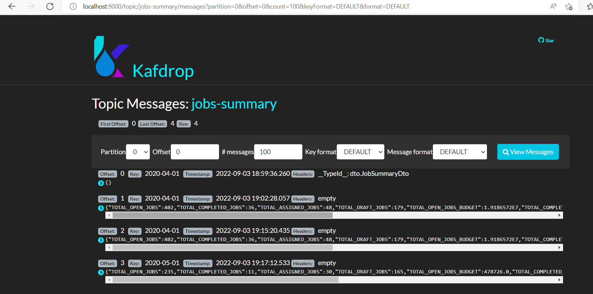
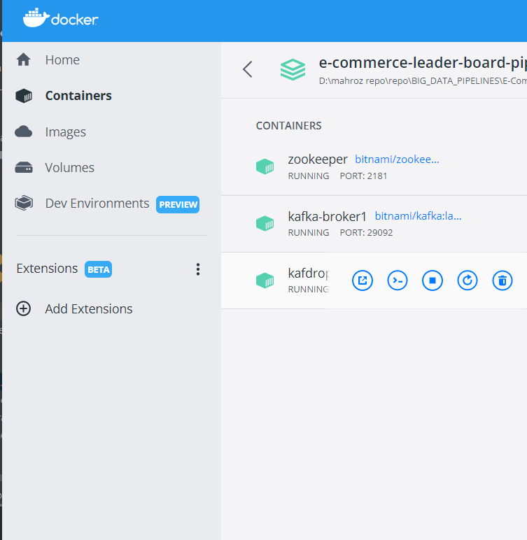

# E-Commerce-Leader-Board-Pipeline

### GOAL
To create a pipeline which extracts data from client db,
Perform data aggregation and extract stats.
Push stats to kafka topic and dump data on which stats are generated to maria db

USE CASE: 
Client has e-commerce site on which user post ad to get any work done, i.e "Need a car driver","Need to fix my PC" etc
Client need to know following :
* How many ad`s posted in given duration.
* How many ad`s are assigned to related officer to fulfil.
* How many no fulfilled.
* etc

### Pre-Requisites:
* Docker 
* Spark
* Kafka

### SETUP
* Fireup docker compose file "spark-cluster" using below command
  docker-compose -f spark-cluster.yml up -d  
  
* Download Hadooop from below URL:
  https://hadoop.apache.org/releases.html
* Extract and copy to C:/hadoop

For windows user`s only:
* Hadoop need winutills to successfully run on window machine
* Please download it from below url and paste all content to C:/hadoop/bin
* You also need to paste winutil files to C:/windows/system32

#### note: D:/tmp/spark-events/    :plz make sure you have this directory as spark uses this to store event logs 
#### or if you don`t want the event logs then just remove this property from session config :  ".config("spark.eventLog.enabled", true)"

### HOW TO RUN

* Execute DataUploader  // you can skip this and directly read the /raw_data using spark.read.parquet("raw_data")
* Finally, Execute Data Processor

### Components:

* ##### DataUploader:
  This class is mainly responsible to upload data from client db  to common file systems for further processing.
  Common file system can be hadoop,S3 or your local systems as we used for this example (/raw_data) is our local file system location.
  
       // creating new Spark Session
      sparkUtil.sparkCreateSession()

      // opening client DB connection
      clientDbUtil.openPostgresDbConnection(appConstants.props.getProperty("db.jobs"))

      // reading boundaries of data , to inform spark that from where it needs to start reading and where it ends
      val dataBoundaries = clientDbUtil.readJobBoundariesFromDb(startDate,endDate)

      //closing Db connection
      clientDbUtil.closeDbConnection()

* ##### DataProcessor: 
  The main function of processor is to read data from file system , analyze, aggregate , generate stats and forward to kafka-topic.

      // creating spark Session
      sparkUtil.sparkCreateSession()

      // Reading Data from file system parquet files that are stored by job status
      var dataset = sparkUtil.sparkReadFromFile(fileDir)
      dataset.show()

      // Creating Local Temp Table to perform aggregation using SQL
      // temp table was only accessible within one session
      dataset.createOrReplaceTempView("GLOBAL_JOBS_TABLE")

      // Verifying GLOBAL_JOBS_TABLE View creation and content
      println("Total Records available : ")
      sparkUtil.spark.sql("SELECT count(*) FROM " + "GLOBAL_JOBS_TABLE").show()

      // Aggregating Data using SPARK SQL
      var summary = sparkUtil.sparkAggregateJobsData(startDate,endDate)
      println("GLOBAL_JOBS_TABLE  Summary: ")
      summary.show()

      // Push Summary Data to a kafka topic , to be consumed by Leader Dashboard client
      sparkUtil.sparkWriteToKafkaTopic(topicName,summary,appConstants.props)
      println("DATA SUCCESSFULLY SEND TO KAFKA!")

      //closing spark session
      sparkUtil.closeSparkSession()

        
 ### Kafka Drop UI SHOT

 

### DOCKER STATUS

  
  

