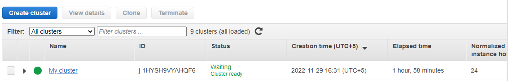
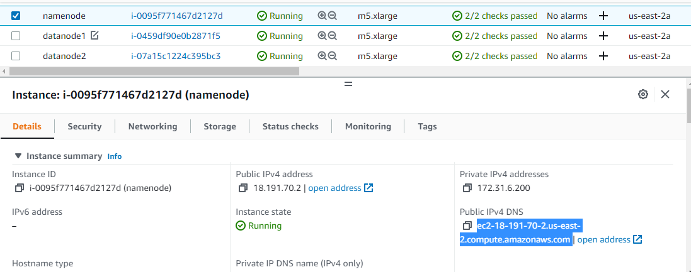
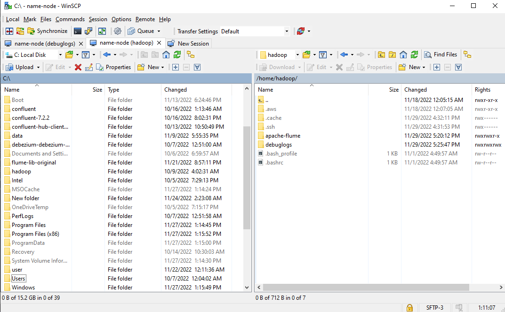
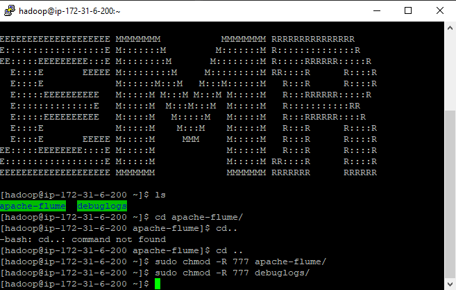
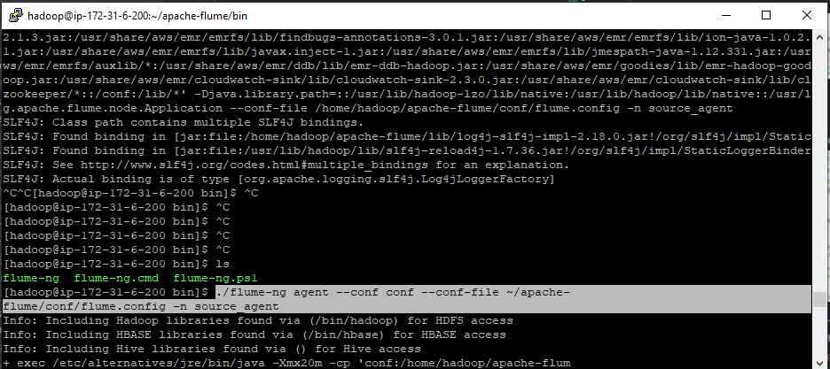
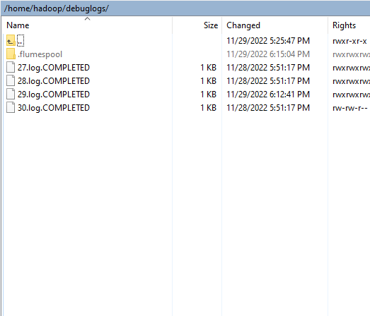
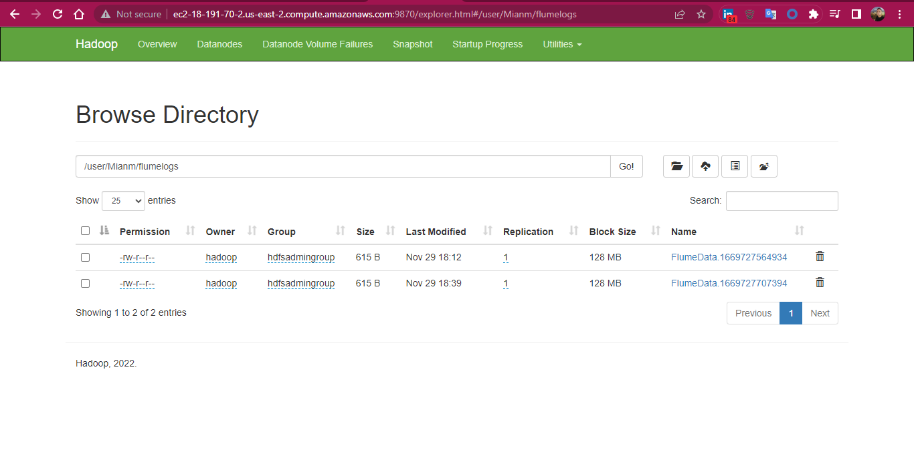
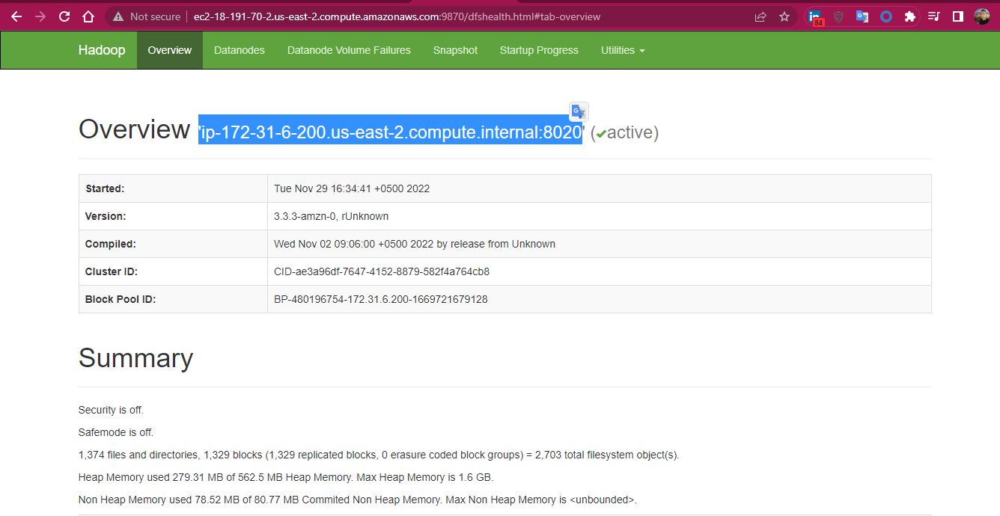

# SERVER LOG PIPELINE USING APACHE FLUME

### GOAL
To collect logs from multiple server nodes using apache flume.
Store them on a HDFS as centralized storage location.
Read and analyze logs using SPARK and ELK STACK

### Pre-Requisites:
* HADOOP CLUSTER

### Collecting logs from Server

##### EMR CLUSTER

##### SSH to namenode instance
* Copy public Ip of namenode from AWS

* SSH to namenode using putty or using WINSCP
* Download apache flume and copy /flume-config/flume.config  to <flume-installation-dir>/config
* Create debuglogs directory and give write permissions.
* 
* 

##### EXECUTE FLUME
* cd to apache-flume/bin and execute below command:
* ./flume-ng agent --conf conf --conf-file ~/apache-flume/conf/flume.config -n source_agent

* Now copy any logs to debuglogs dir, and it will move to hadoop cluster.
* 
* 

## Notes
* In flume config use namenode Ip copied from namenode UI:
* 
* Commands if needed:
* hadoop namenode -format
* sudo -u hdfs hadoop fs -ls /user/Mianm/flumelogs
* sudo -u hdfs hadoop fs -mkdir /user/Mianm/flumelogs
* sudo -u hdfs hadoop fs -chown Mianm:Mianm /user/Mianm/flumelogs